# mind-and-mastery
A static website built with HTML and CSS.
# Table of Contents
- [Introduction](#)
- [UX](#UX)
    - [Target Audience](#Target-Audience)
    - [User Stories](#User-Stories)
- [Design](#Design)
    - [Colour Pallet](#Colour-Pallet)
    - [Typography](#Typography)
    - [Images](#Images)
    - [Wireframes](#Wireframes)
- [Features](#Features)
    - [Site Wide Features](#Site-Wide-Features)
    - [Home Page](#Home-Page)
    - [Articles](#Articles)
    - [My Mastery](#My-Mastery)
- [Technologies Used](#Technologies-Used)
- [Testing](#Testing)
    - [HTML Validation](#HTML-Validation)
    - [CSS Validation](#CSS-Validation)
    - [Lighthouse Testing](#Lighthouse-Testing)
- [Deployment](#Deployment)
- [Credits](#Credits)
- [Acknowledgements](#Acknowledgements)

# Introduction
The aim of this project is to build a website that people can find out more about Stoicism. The website aims to be an online resource where users can access articles, books, podcasts and sign up for a newsletter.
The idea to build a website about stoicism came from seeing a book called The Daily Stoic on my kitchen table.

 # Target Audience
 My target audience for this website is people between the ages of 20 and 45. Men and Women who want a point of reference for all things stoic and philosophy related. I wanted to keep the website predictiable and easy to navigate but also add a contempory  feel throughout. The use of high quality images and layouts acieve this.
 # User Stories
## As a user I want to join a community interested in stoicisim
The very first hero image that the user sees when the site loads calls for users to sign up using the form on the my mastery page.
This Call to Action can be found within the aside on each article page.

## As a user I want to read articles about some of the topics I am interested in
Using the navigation link "Articles" or scrolling down will bring the user to some published articles on the site. Users will get a short snippet of the article and the option to read more which will bring them to a seperate page containing the full article.

## As a user I want to see some feedback from other users who have signed up to Mind & Mastery
There is a small card within the articles sections which has a review from a current subscriber of Mind & Mastery. This is to inform prospective subscribers of how much current and past like their choice of signing up.

## As a user I would like to recieve promotional emails or newsletters from Mind & Mastery
There is a small form where users can add their email to subscribe to newsletters

## As a user I would like the site to be responsive.
I have added media queries to adjust to mobile breakpoints and have used rem and percentages in any elements which needed to be flexiable in their sizing

 # Design
 ## Colour Pallet
 The Color Pallet inspiration for Mind & Mastery came from towels hanging on the back of my bathroom door.
 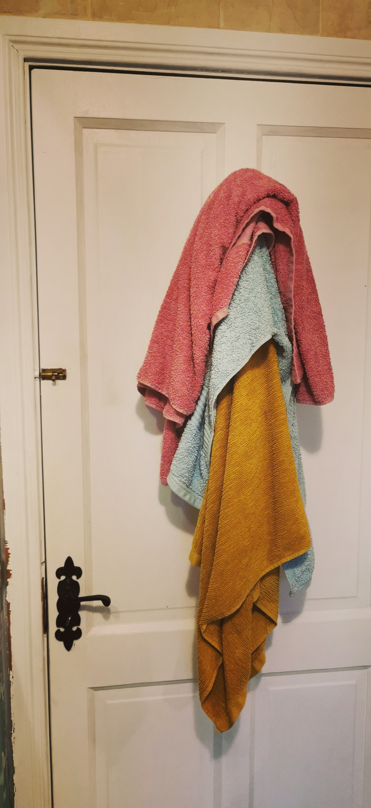
 I used [Colormind.io](http://colormind.io/) to make a color pallet out of the image.
 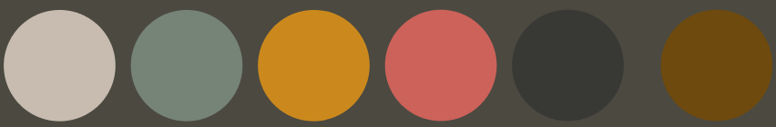
 |Light|Green|Yellow|Red|Dark|Brown|
 |---|---|---|---|---|---|
 |#C7BCAF|#768377|#CB891D|#CC625A|#383835|#6E4A0F|

 ## Typography
 I used a serif font, Cinzel for the logo and headings throughtout the site, that I found from Google Fonts because I thought that it felt elegant and easy to read.
 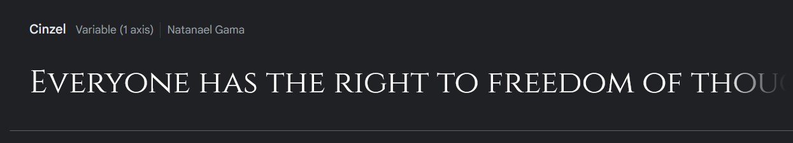
 I used a neutral sans-serif font Heebo for the main copy throughout the site.
 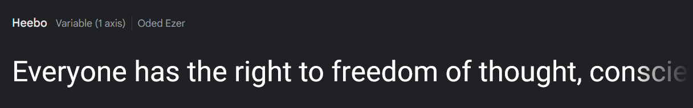

 ## Images 
 All of the images for this site came from unsplash. I tried to find images which evoked a stoic feeling and complemented the color pallet.
 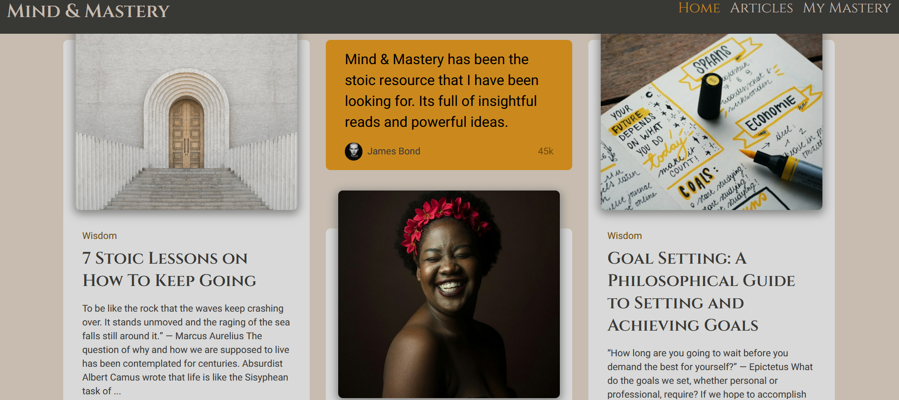
 ## Wireframes
 I used [Figma](https://www.figma.com) to build out my wireframes, I found it easy and intuitive to use and felt like it made sense to get comfortable working with the industry standard for this project
 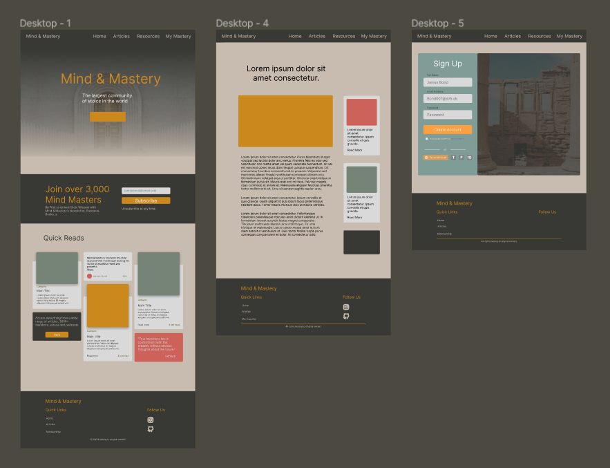
 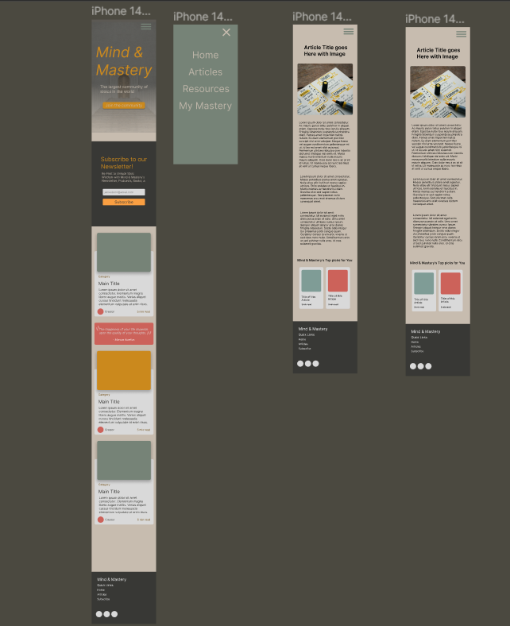

# Features
 ## Site Wide Features
 ### Navigation
 I wanted to make moving throughtout the site as easy as possible for the user and I feel like my use of responsive navigation which is fixed to the top of the screen as they scroll as well as a simple navigation in the footer achieve this.

 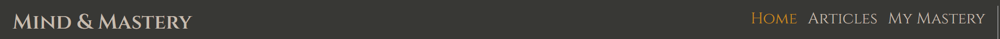
 Desktop Navigation
 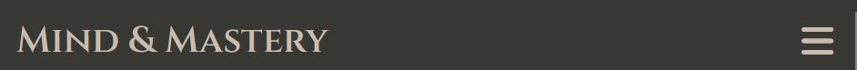
 Mobile Responsive Burger Menu
 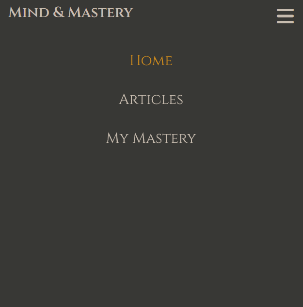
 Mobile Navigation Expanded
 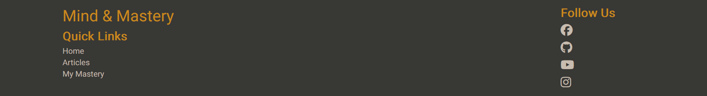
 Footer Navigation

 Each Navigation link has a hover effect applied to make it clear to the user that it is clickable.

 
### Footer
As well as the footer being a point of navigating the site for the user it also acts as home for users to connect with Mind & Mastery on social channels.
I have included some small text at the bottom of the footer to simulate where copyright or other relevant information might go.

 ## Home Page
 The Home Page can be broken into 3 seperate sections
 the Hero section where the user sees a CTA as well as the name of the website and what its about
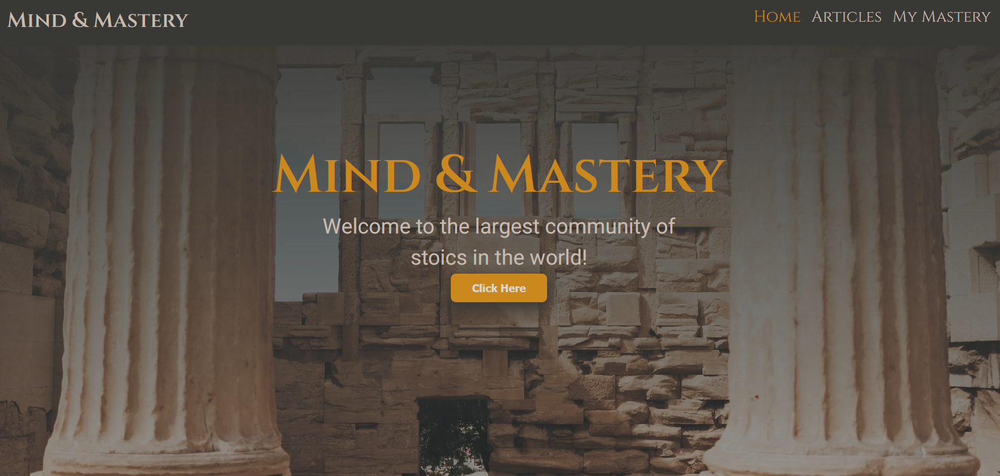

 The Subscription Banner is simply a Call to Actiion for the user to sign up, using the form, for the Newsletter and other email associated content from Mind & Mastery
 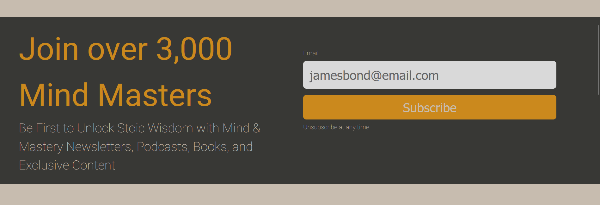

 The Quick Links is the section containing the articles and links to their respective pages. I also have a container with a Quote from a famous  stoic because its relevant to the site. I have a container with a quick review from a subscriber and another small CTA to the sign up page.
 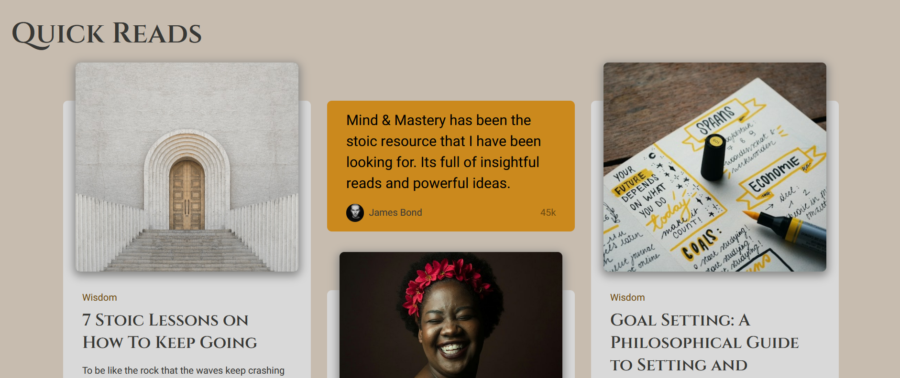
 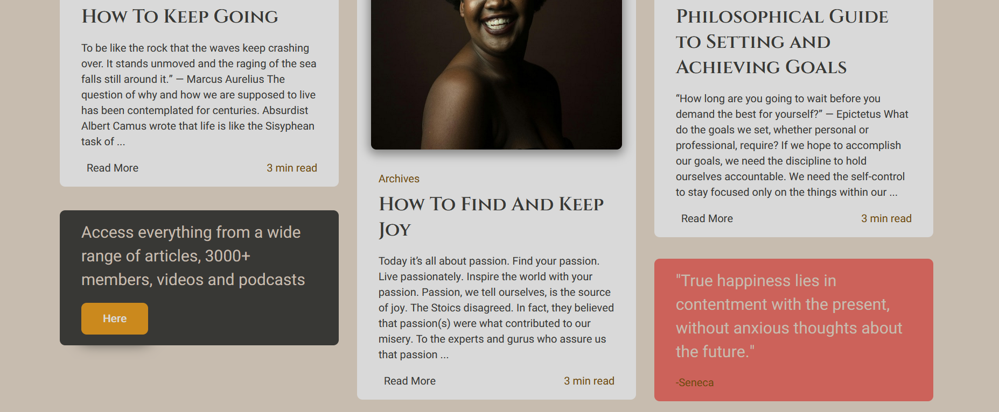
 ## Articles
 For consistency each Article page follows the same layout.
 a heading followed by the image, followed by the article and a link to the origional article
 Each Article page also has an aside containing links to other articles which make it easier for users to read the next one instead of returning to the home page.
 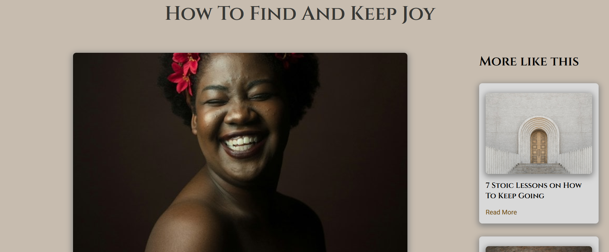
 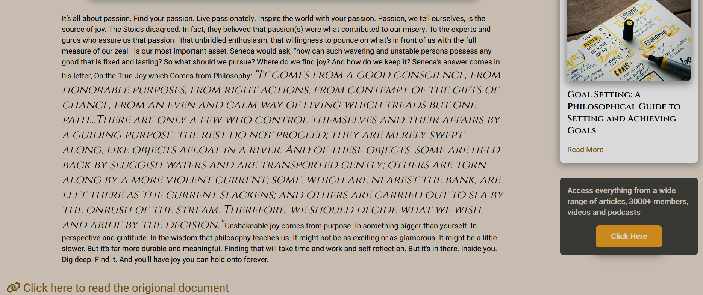
 ## My Mastery
 The My Mastery page is the point of entry into the resources that the site offers. It is a simple sign up form with validation to. I added a relevant image beside the form with the same Call to Action copy the user has seen before throughout the site as to let them know that they have reached the right form.
 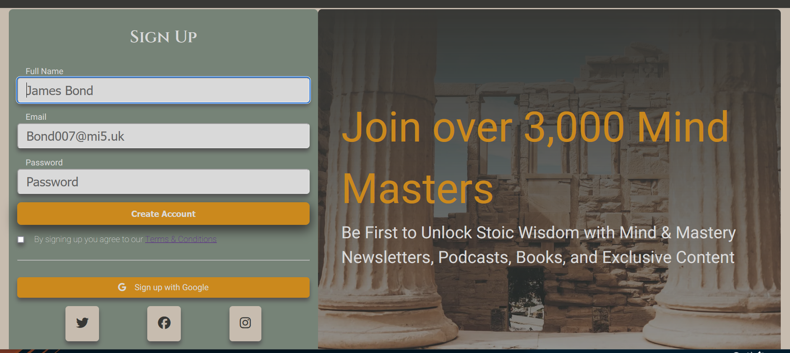

# Technologies Used

[HTML](https://html.com/html5/) is used for adding all the copy and images to each page as well as creating forms and lists.

[CSS](https://www.w3schools.com/Css/) is used throughout this project to style the overall website.

[Colormind](http://colormind.io/) is used for the color pallet.

[Font Awsome](https://fontawesome.com/) was used for adding Icons

[Unsplash](https://unsplash.com/) was where I got of the images on this site license free.

[GitHub](https://github.com) is used as a remote repository for the projects source code.

[Git](https://git-scm.com/) was used to commit and push the code to GitHub.

[Visual Studio Code](https://visualstudio.microsoft.com/) is the IDE I used for writing the code for this project.

[Figma](https://figma.com/) was used for creating wireframes

[Image Resizer](https://imageresizer.com/) is where I reduced the size of the images inorder to reduce the loadtime of each page.

[favicon.io](https://favicon.io/) is the site I used to create the site icon.

# Testing
 ## HTML Validation
 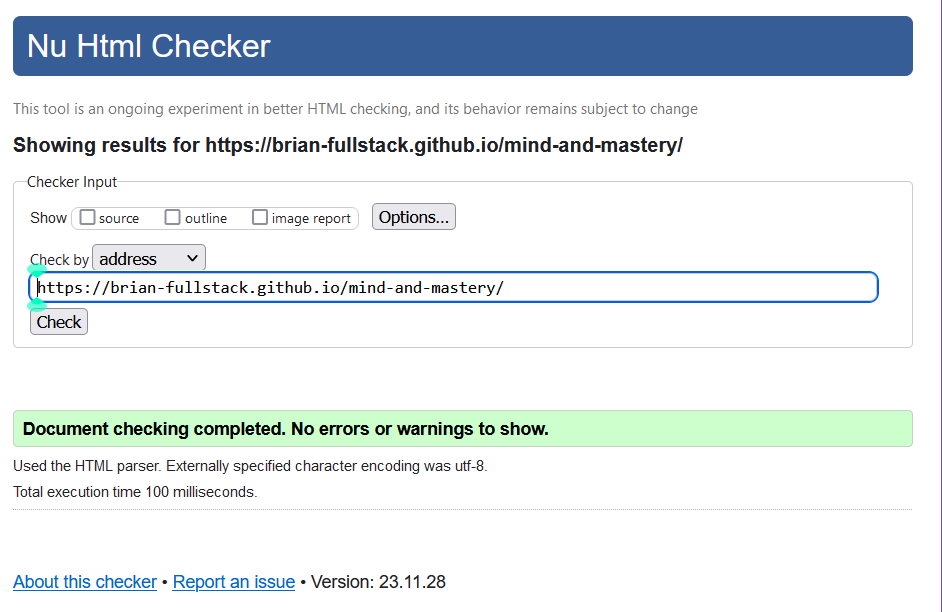
 ## CSS Validation
 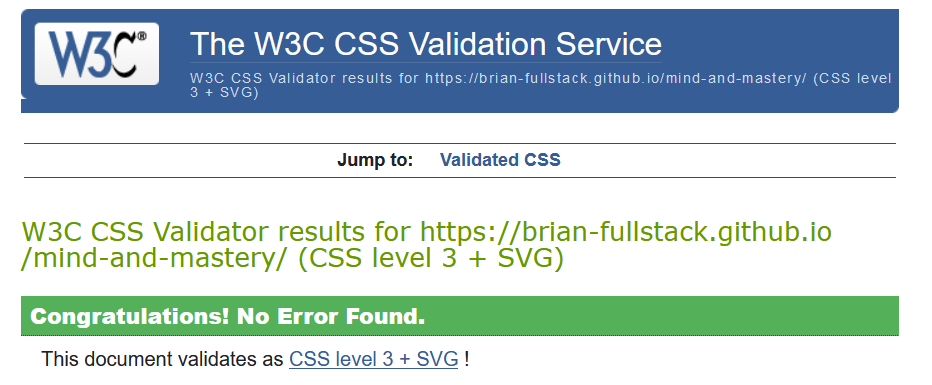
 ## Lighthouse Testing
 I tested the preformance of each page of the site using Chrome Lighthouse testing. There is room for improvment with performance and SEO in the future but due to time constraints I didn't have time to fix it.
 - Home Page
 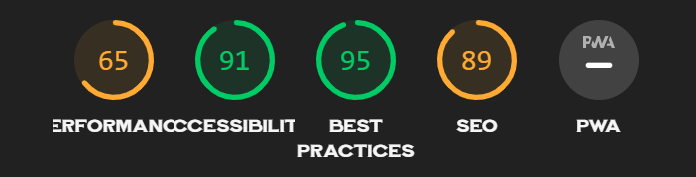
  - Article Page
 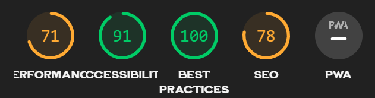
 - My Mastery Page
 

 # Deployment
## Git Hub Pages

I deployed this website using GitHub pages. The process I used is as follows:

- I logged into my Github account and selected my project from my repositories.
- I clicked on 'Settings' in the repository.
- In the menu on the left I clicked on 'Pages'.
- I then clicked on 'Source'.
- I clicked on the dropdown menu that said 'None' and then selected 'Main'.
- After the page reloaded I clicked on the link to the deployed site.

## Forking this GitHub Repository

Follow these steps to fork the GitHub Repository

- Log into GitHub and find the repository.
- Click the 'Fork' button located in the top right of the page.
- This will make a copy of the repository on your own GitHub account.

## Clone this Repository

To make a local clone of this repository follow these steps:

- Log into GitHub and find the repository.
- Click on the 'Code' button.
- To clone the repository using HTTPS, copy the url.
- Open Git and change the current working directory to where you want the cloned directory to be made.
- In the terminal type 'git clone' followed by the https url.
- Press enter
- The local clone will be created.

 # Credits
 - All of the content for each article came straight from [The Daily Stoic](https://dailystoic.com/) website. 
 - Each image was taken from [Unsplash](https://unsplash.com/)
 - I had some difficulty styling the images in the cards but I learned how to target specific elements in divs from [Here](https://copyprogramming.com/howto/select-first-div-of-mutliple-div-with-same-class-name-duplicate#select-first-div-of-mutliple-div-with-same-class-name-duplicate*)
 # Acknowledgements
